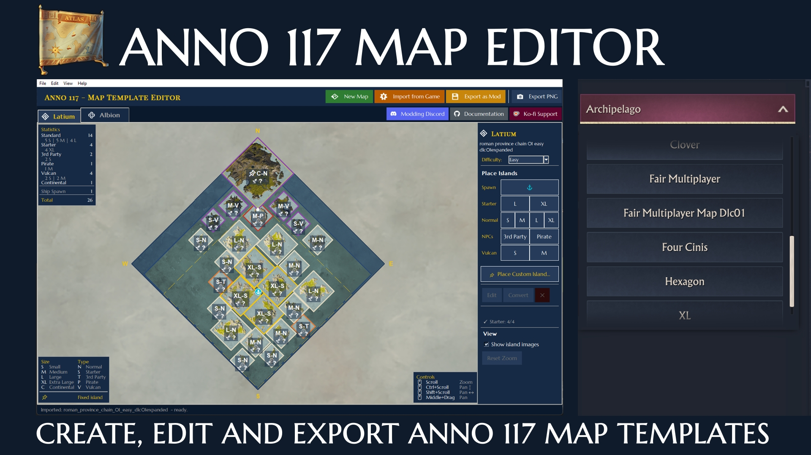

# TAMPER - Taludas Anno 117 Map Template Editor

> A standalone desktop application for creating, editing, and exporting **Anno 117** map templates (`.a7tinfo`).



-> Deutsches Readme findet ihr [hier](README_de.md)

---

## Table of Contents

- [TAMPER - Taludas Anno 117 Map Template Editor](#tamper---taludas-anno-117-map-template-editor)
  - [Table of Contents](#table-of-contents)
  - [1. Overview](#1-overview)
  - [2. System Requirements](#2-system-requirements)
  - [3. Installation](#3-installation)
    - [Standalone Binary (Recommended)](#standalone-binary-recommended)
    - [Running from Source](#running-from-source)
  - [4. First-Time Setup](#4-first-time-setup)
  - [5. Interface Overview](#5-interface-overview)
  - [6. Feature Reference](#6-feature-reference)
    - [6.1 Creating a New Map](#61-creating-a-new-map)
    - [6.2 Importing an Existing Template](#62-importing-an-existing-template)
    - [6.3 The Map Canvas](#63-the-map-canvas)
    - [6.4 Placing Islands](#64-placing-islands)
    - [6.5 Custom (Fixed) Islands](#65-custom-fixed-islands)
    - [6.6 Ship Spawn Points](#66-ship-spawn-points)
    - [6.7 Moving and Repositioning](#67-moving-and-repositioning)
    - [6.8 Collision Detection](#68-collision-detection)
    - [6.9 Enlarged (DLC01) Templates](#69-enlarged-dlc01-templates)
    - [6.10 Island Properties Dialog](#610-island-properties-dialog)
    - [6.11 Validation and Limits](#611-validation-and-limits)
  - [7. Saving and Exporting](#7-saving-and-exporting)
    - [7.1 XML Save / Load](#71-xml-save--load)
    - [7.2 Export to .a7tinfo](#72-export-to-a7tinfo)
    - [7.3 Export PNG](#73-export-png)
    - [7.4 Export as Playable Mod (.zip)](#74-export-as-playable-mod-zip)
  - [8. Island Reference](#8-island-reference)
    - [Pool Limits (random islands per region)](#pool-limits-random-islands-per-region)
    - [Island Size Reference (game pixels)](#island-size-reference-game-pixels)
  - [9. Technical Notes](#9-technical-notes)
    - [File Format](#file-format)
    - [Coordinate System](#coordinate-system)
    - [Island Registry](#island-registry)
    - [PyInstaller Build](#pyinstaller-build)
  - [10. License and Credits](#10-license-and-credits)
    - [Dependencies:](#dependencies)
    - [License:](#license)
    - [Credits:](#credits)

---

## 1. Overview

**TAMPER** is a community-built visual editor for the map template system in **Anno 117: Pax Romana**. The game generates its playable worlds procedurally from map *templates* - binary files (`.a7tinfo`) that define which islands may appear, where, at what size, and in what configuration. TAMPER gives modders a graphical interface to create and modify these templates without manually editing XML.

**What you can do with TAMPER:**

- Design complete map layouts for both Latium (Roman) and Albion (Celtic) regions from scratch.
- Import and visually inspect any existing game template, including vanilla maps.
- Place random islands (Small, Medium, Large, ExtraLarge) by type (Normal, Starter, 3rd Party, Pirate, Vulcan).
- Pin specific game island files as fixed islands with rotation, island label, and handcrafted fertility assignments.
- Position ship spawn points.
- Configure the Playable Area and, for DLC01-enabled maps, the Enlarged Playable Area.
- Export the result directly to a ready-to-install playable mod `.zip` package for all three difficulty variants or - for more experienced modders - to .a7tinfo or xml files.

TAMPER operates as a standalone GUI application (Tkinter) and does not modify game files in place. It reads and writes Anno's proprietary binary format via the open-source **FileDBReader** tool.

---

## 2. System Requirements

| Component | Requirement |
|---|---|
| Operating System | Windows 10/11 (64-bit) or Linux |
| Python | 3.10 or newer (source mode only) |
| Pillow | 9.x or newer (`pip install pillow`) (source mode only) |
| FileDBReader | Required for `.a7tinfo` import/export - [download from GitHub](https://github.com/anno-mods/FileDBReader/releases) |
| RdaConsole | Required for **Import from Game** only - [download from GitHub](https://github.com/anno-mods/RdaConsole/releases) |
| Anno 117 | Required for **Import from Game** only; not required for editing or export |

> **Linux note:** FileDBReader provides a native Linux binary. RdaConsole currently ships a Windows-only `.exe`; importing directly from game archives therefore requires Wine. All other editor functionality - creating, editing, and exporting maps - works natively on Linux.

---

## 3. Installation

### Standalone Binary (Recommended)

Download the latest `.exe` from the [Releases](../../releases) page. No Python installation is required. Place the binary wherever you prefer and run it directly.

FileDBReader/RDAConsole is **not** bundled and must be downloaded separately. The editor will prompt you on first launch if it cannot locate it automatically.

### Running from Source

```bash
git clone https://github.com/taludas/anno-117-map-editor.git
cd anno-117-map-editor
pip install -r requirements.txt
python main.py
```

**Requirements:**

```
pillow>=9.0
```

Place `FileDBReader.exe` (Windows) or `FileDBReader` (Linux) and `RDAConsole.exe` in one of the following locations and the editor will find it automatically:

- `tools/FileDBReader[.exe]` (relative to `main.py`)
- `C:\tools\FileDBReader.exe` (Windows default)
- `~/.local/bin/FileDBReader` (Linux default)

---

## 4. First-Time Setup

On first launch the editor checks for the required tools and displays a setup dialog if anything is missing.

**Game Path**
Set via `Edit → Set Game Path…` or auto-detect. The editor searches known Ubisoft Connect, Steam, and Epic install directories automatically. Used for the "Import from Game" workflow.

**FileDBReader Path**
Set via `Edit → Set FileDBReader Path…` if not auto-detected. Required for importing `.a7tinfo` files and for compressing exports. Points to the `FileDBReader` executable.

**RdaConsole Path**
Set via `Edit → Set RdaConsole Path…`. Required only if you intend to use `File → Import from Game`, which extracts map templates directly from the game's RDA archives. Not needed for editing XML files or exporting.

All paths are saved across sessions in the platform-appropriate user config directory (`%APPDATA%\Anno117MapEditor` on Windows, `~/.config/Anno117MapEditor` on Linux).

---

## 5. Interface Overview


**Tabs:** Each region (Latium / Albion) has its own tab with an independent map canvas and side panel. Templates for both regions can be open simultaneously.

**Canvas:** The map is rendered in an isometric (rotated 45°) projection matching the in-game view. Compass directions (N/S/E/W) are shown at the map edges. A legend showing control hints and a statistics panel are shown in the corners.

**Side Panel:** Contains the island placement palette, selection action buttons, island limit warnings, a starter island counter, and display toggles.

---

## 6. Feature Reference

### 6.1 Creating a New Map

`File → New…` (or the **New Map** header button) opens the New Map dialog.

**Settings:**

| Field | Description |
|---|---|
| Region | Latium (Roman) or Albion (Celtic) |
| Difficulty | Default difficulty for auto-derive of other difficulties on mod export |
| Enlarged template | Enable DLC01 (Prophecies of Ash) expansion support |
| Border distance | Distance in game pixels from map edge to playable area boundary |
| X / Y axis offset | Asymmetric offset of the playable area centre |

**Playable Area (PA):** The editor uses a *border distance* + *offset* model. PA coordinates are always snapped to multiples of 4 px (game requirement). The formula is:

```
PA = (dist + ox,  dist + oy,  size − dist + ox,  size − dist + oy)
```

Slider ranges automatically enforce a minimum 20 px border on all sides. Values can be entered directly in text fields alongside the sliders.

**Enlarged templates:** Checking "Enlarged template" creates a DLC01-compatible layout. The map uses a larger total size (2688 × 2688 for Latium) and the editor manages both the regular *InitialPlayableArea* (visible without DLC) and the full *PlayableArea* (unlocked with DLC01). The Initial PA is derived automatically from the full PA - it is never stored separately.

**Live preview:** A real-time isometric thumbnail shows both the Latium and Albion playable areas side-by-side as sliders are adjusted.

When confirmed, TAMPER creates the selected region's template and also initialises a default empty template for the complementary region, so both tabs are immediately editable.

---

### 6.2 Importing an Existing Template

**From Game Archives** (`File → Import from Game…`):
Opens a browseable tree of all map template assets extracted from the game's RDA archives. Select an entry and click "Import". The editor automatically:
- Extracts and decompresses the `.a7tinfo` file using RdaConsole and FileDBReader.
- Detects the region from the file path (`roman` → Latium, `celtic` → Albion).
- Loads the counterpart region's template (e.g. Albion when importing a Latium file) automatically.
- Detects the difficulty from the filename suffix (`_easy`, `_medium`, `_hard`).

**From `.a7tinfo` file** (`File → Import .a7tinfo…`):
Directly imports any `.a7tinfo` binary file. Decompresses it to XML via FileDBReader, then loads the result into the active tab.

**Open XML** (`File → Open XML…`):
Opens a plain XML file previously saved by the editor. No FileDBReader required.

---

### 6.3 The Map Canvas

**Navigation:**

| Action | Gesture |
|---|---|
| Zoom | Scroll wheel |
| Pan (vertical) | Ctrl + scroll |
| Pan (horizontal) | Shift + scroll |
| Pan (free) | Middle mouse drag |
| Fit to window | View → Fit to Window |

**Coordinate system:** Game coordinates use a standard (gx, gy) system where gx increases to the East and gy to the North. The lower-left corner (SW in the isometric view, i.e. the bottom tip of the diamond) is (0, 0). Island positions refer to the lower-left corner of the island's axis-aligned bounding box (AABB).

**Overlays:**
- Selected island: an info panel with position, size, type, rotation, and file path appears in the top-left of the canvas.
- Ghost island: when in placement mode, a colour-coded ghost follows the cursor - green when the position is valid, red when it would violate collision rules.
- Playable area: rendered as a diamond outline. Enlarged maps show both the full PA and the Initial PA.

**Legend and statistics:** Panels in the corners shows keyboard/mouse controls, island size/type abbreviations, and per-type island counts for the current template.

---

### 6.4 Placing Islands

Select a size and type from the side panel to enter **ghost placement mode**. The cursor changes to a crosshair and a semi-transparent ghost follows mouse movement.

**Island types and valid sizes:**

| Type | Valid Sizes | Notes |
|---|---|---|
| Normal | S, M, L, XL | Main building islands |
| Starter | L, XL (Latium) / L (Albion) | Player start islands |
| 3rd Party | S only | NPC faction islands |
| Pirate | M only | Pirate faction islands |
| Vulcan | S, M | Volcanic islands (Latium only) |
| Continental | Fixed only | DLC01 large landmass |

**Placement controls:**
- **Left-click** - commit the ghost island at the current position.
- **Middle-click** (click, not drag) - rotate the ghost 90° clockwise. Middle-drag pans the camera without rotating.
- **`.` and `,` key** - also rotates 90° clockwise.
- **`Esc`** - cancel placement.

The ghost is painted red and placement is blocked if the position would:
- Cause overlap or insufficient spacing with an existing island.
- Push the island outside the Playable Area boundary.
- Cover an existing ship spawn point.

Once placed, islands can be dragged, resized (via Edit), or repositioned with arrow keys.

---

### 6.5 Custom (Fixed) Islands

Click **📌 Place Custom Island…** to open the **Fixed Island Picker**. This dialog lists all `RandomIsland` assets parsed from the game's `assets.xml`. Islands are filterable by name and by type (Normal, Starter, ThirdParty, Pirate, Vulcan, Continental).

Select an island and click **Place** to enter ghost placement mode for that specific island file.

**Fixed island properties** (accessible via the right click **Island Properties** dialog or the picker):

| Property | Description |
|---|---|
| Map File Path | `.a7m` file path relative to the game data root |
| Island Label | Optional label |
| Rotation | 0°, 90°, 180°, or 270° |
| Island Type | Normal, Starter, ThirdParty, Pirate, Vulcan, Continental |
| Randomise Fertilities | When checked: the game selects fertilities at runtime (recommended for most cases) |
| Fertility GUIDs | When "Randomise" is unchecked: explicit list of fertility GUIDs assigned to this island |

**Fertility assignment:** Fixed islands can have their fertilities explicitly specified. In the Island Properties dialog, fertilities are presented as a checkbox list grouped by type (Universal, Roman/Latium-specific, Celtic/Albion-specific). Checking individual boxes builds the GUID list. Alternatively, "Randomise fertilities" can be enabled to let the game select fertilites from the appropriate pool at runtime.

---

### 6.6 Ship Spawn Points

Select **Spawn** in the side panel (anchor icon) to place a ship spawn point - the position where the player's starting fleet appears. Every map template must contain at least one spawn point.

Spawn points:
- Are placed and moved like islands.
- Support arrow key movement (8 px per keystroke).
- Can be duplicated with a double-click.
- Cannot be placed inside an island's bounding box (collision is checked in both directions: islands cannot move over spawns, and spawns cannot move into islands).

---

### 6.7 Moving and Repositioning

**Mouse drag:** Left-click and drag an island to move it freely. Collision checking happens continuously during drag. The island info overlay in the top-left updates live during drag, showing the current position.

**Arrow keys:** With one or more islands selected, use arrow keys to nudge by the grid snap (8 px). Collision blocking applies to arrow key movement as well.

**Multi-select:** Hold Shift while clicking to add islands to the selection. Arrow key movement applies to all selected islands simultaneously, treating the group as a rigid body for collision purposes.

**Grid snap:** All island positions are snapped to multiples of 8 px (game requirement). Positions are also snapped when islands are pushed to the Playable Area boundary.

**Undo / Redo:** Full undo history is maintained (`Ctrl+Z` / `Ctrl+Y`). Each placement, move, delete, and property change is a separate undo step.

---

### 6.8 Collision Detection

TAMPER enforces three categories of spatial constraints:

**Island–island clearance:**
Islands' axis-aligned bounding boxes (AABBs) must not overlap.

**ExtraLarge island border clearance (`XL_COLLISION_GAP`):**
ExtraLarge islands require an additional 64 px clearance from the Playable Area boundary on all sides. This is enforced during placement, dragging, and arrow key movement and is necessary due to reduced display size of XL islands in the app. The bounding boxes are larger in the game, which would obstruct the user's view of the map template if they were left as they are.

**Continental island underlap:**
Other islands are permitted to overlap the Continental island's AABB, but *only* within the bounds of the `InitialPlayableArea`. This reflects the game's actual behaviour where the ocean surrounding the continent is placed above the continental landmass.

**Spawn point collision:**
Islands cannot be moved to cover a ship spawn point. Conversely, spawn points cannot be moved inside an island's bounding box.

When a move or placement would violate any of these rules, the ghost or drag is blocked and the ghost is coloured red.

---

### 6.9 Enlarged (DLC01) Templates

The "Prophecies of Ash" DLC expands the Latium map with a larger playable area and a Continental island. TAMPER supports this through the **Enlarged template** mode.

**How it works:**
- The full `PlayableArea` covers the expanded DLC-enabled extent.
- The `InitialPlayableArea` is derived automatically as `(PA.x1, PA.y1, PA.x2 − 420, PA.y2 − 420)`.
- Islands marked as **Locked** appear in the base-game `.a7tinfo` (pre-DLC content visible to all players).
- Islands marked as **Unlocked** appear only in the `_enlarged.a7tinfo` (DLC content, unlocked when Prophecies of Ash is active).
- The editor exports both the regular and `_enlarged` variants automatically when building a mod.

**Locking islands:** Right-click any island on the canvas and toggle **Locked** to control which variant it belongs to.

---

### 6.10 Island Properties Dialog

Accessible by selecting an island and clicking **Edit**, or via the right-click context menu.

For **random islands:**
- Change size and type.
- Convert to a fixed island (loads the Fixed Island Picker).

For **fixed islands:**
- Change the map file path, island label, rotation, island type, and fertility settings.
- Detailed fertility assignment via checkbox list (see Section 6.5).

Validation is performed when confirming: invalid size/type combinations (e.g. 3rd Party set to Large) are rejected with a descriptive error message.

---

### 6.11 Validation and Limits

**Side panel warnings:** The side panel continuously shows:
- Per-type island count warnings when pool limits are exceeded (e.g. too many XL Normal islands).
- A starter island counter showing progress toward the minimum of 4.

**Export warnings:** Before any export that requires deployment (mod zip), the editor runs a full validation pass and displays all detected issues with a "Proceed anyway?" prompt. Checks include:
- Type/size rule violations (e.g. Pirate must be Medium).
- Per-region island pool limit overruns.
- Islands placed outside the Playable Area.
- Islands >50% into the border zone (soft warning for continental islands).
- Missing ship spawn points (hard block for mod export).
- Insufficient Starter islands (< 4, hard block for mod export).

---

## 7. Saving and Exporting

### 7.1 XML Save / Load

`File → Save XML` / `File → Save XML As…` - saves the **active tab's** template as a plain human-readable XML file. This is the editor's native working format. No FileDBReader is required to save or re-open XML files.

`File → Open XML…` - opens an XML file into the active tab.

The XML format is the decompressed representation of the `.a7tinfo` binary - all fields map directly.

### 7.2 Export to .a7tinfo

`File → Export .a7tinfo…` - exports the **active tab's** template and compresses it to the binary `.a7tinfo` format via FileDBReader. This produces a file that can be dropped into a mod's folder structure and loaded by the game.

FileDBReader must be configured (see Section 4).

### 7.3 Export PNG

`File → Export PNG…` (or PrtScn shortcut) - renders the active tab's canvas as a PNG image, cropped to the playable area. Useful for documentation and preview images.

### 7.4 Export as Playable Mod (.zip)

`File → Export as Mod (.zip)…` (or Ctrl+S) - the most complete export path. Packages both the Latium and Albion templates into a ready-to-install Anno 117 mod.

**What is generated:**

- Three `.a7tinfo` difficulty variants per region (`easy`, `medium`, `hard`).
- For enlarged Latium: additionally three `_enlarged.a7tinfo` variants (full DLC-enabled PA).
- Pre-baked `.a7t` / `.a7te` binary template files (bundled with the editor).
- `assets.xml` with full `MapTemplate` asset definitions including horizon islands and DLC settings.
- `modinfo.json` with the mod name, description, GUID range, and dependency information.
- Locale XML files for all 12 supported languages (name and description are pre-filled in English; use your own translation tools for other languages).

**Dialog options:**

| Field | Notes |
|---|---|
| Mod Name | Lowercase, hyphens only, no underscores. Used as file names and ModID. |
| Description | English description for the mod manager. |
| Start GUID | The first GUID in the range. Seven consecutive GUIDs are reserved. |
| Personal GUID range | A private testing range (2001001000–2001009999). Exports in this range install directly; no shareable zip is produced. |
| Own reserved range | Enter a community-registered GUID range for public publication. |
| Auto-derive difficulties | When enabled, Medium and Hard difficulty variants are generated algorithmically by scaling island sizes rather than copying the source template identically (see below). |
| Direct install | When available, installs the mod folder to the game's `mods/` directory immediately after building. |

**Auto-derive difficulties:**
When "Auto-derive other difficulty variants from this map" is checked, the editor applies the following island size transformations to produce the missing difficulty variants from whichever difficulty the source template is set to:

| Conversion | Normal island changes | Starter island changes |
|---|---|---|
| Easy → Medium | Every 2nd L→M; every 4th M→S | No change (L is minimum) |
| Medium → Hard | All XL→L; every 2nd L→M; every 2nd M→S | XL→L |
| Hard → Medium | All L→XL; every 2nd M→L; every 2nd S→M | L→XL |
| Medium → Easy | Every 2nd M→L; every 4th S→M | No change |

Easy→Hard and Hard→Easy conversions chain through Medium. Fixed islands and non-Normal-type random islands (Pirate, ThirdParty, Vulcan) are not resized.

---

## 8. Island Reference

### Pool Limits (random islands per region)

| Type | Size | Latium | Albion |
|---|---|---|---|
| Normal | ExtraLarge | 4 | - |
| Normal | Large | 8 | 8 |
| Normal | Medium | 8 | 7 |
| Normal | Small | 7 | 7 |
| ThirdParty | (any) | 2 | 2 |
| Pirate | (any) | 1 | 1 |
| Vulcan | Medium | 3 | - |
| Vulcan | Small | 2 | - |

Fixed islands are not counted toward these limits.

### Island Size Reference (game pixels)

| Size label | AABB side (game px) |
|---|---|
| Small | 256 |
| Medium | 320 |
| Large | 435 |
| ExtraLarge | 435 |
| Continental | 768 |

Note: Large and ExtraLarge share the same AABB dimension; they differ in the pool they draw from and in island artwork. According to the island files, both island types are actually 512px, but a lot of empty space is included around the L island model and a little less around the XL. I therefore decided to reduce the display size, as the original side length would lead to significant visual overlap on imported vanilla map templates.

---

## 9. Technical Notes

### File Format

`.a7tinfo` files are compressed binary files in Ubisoft's FileDB format. The editor works entirely with the decompressed XML representation and delegates compression/decompression to **FileDBReader**. The XML structure follows Ubisoft's `MapTemplate` asset schema as documented in the community's reverse-engineering efforts.

### Coordinate System

Game coordinates are axis-aligned integers in "game pixels". The map is a square grid; (0, 0) is the south-western corner (bottom tip in isometric view). Islands are represented by their lower-left corner position. All island positions must be divisible by 8.

### Island Registry

On startup the editor asynchronously parses the game's `assets.xml` (extracted to the user data directory) to build the Fixed Island Picker's catalogue. If `assets.xml` is not available (game not extracted yet), the picker shows a prompt to run extraction first. The registry loads in the background and does not block the UI.

### PyInstaller Build

The standalone binary is built using PyInstaller:

```bash
pyinstaller anno117-map-editor.spec
```

The spec file bundles the entire `data/` directory and the mod template folders (`[Map] $ModName (TAMPER)/`) into the single-file executable.

---

## 10. License and Credits

TAMPER is a community tool and is **not affiliated with or endorsed by Ubisoft Mainz**.

Anno 117: Pax Romana is a trademark of Ubisoft Entertainment.

### Dependencies:

| Tool / Library | Author | License |
|---|---|---|
| [FileDBReader](https://github.com/anno-mods/FileDBReader) | anno-mods | MIT |
| [RdaConsole](https://github.com/anno-mods/RdaConsole) | anno-mods | MIT |

### License:
MIT

### Credits:
- Taubenangriff and Jakob for their excellent work on the existing tool pipeline
- Claude Code for making my vision of a map editor come true

---

*For questions, bug reports, and contributions, please open an issue or pull request on the [GitHub repository](https://github.com/taludas/anno-117-map-editor).*
